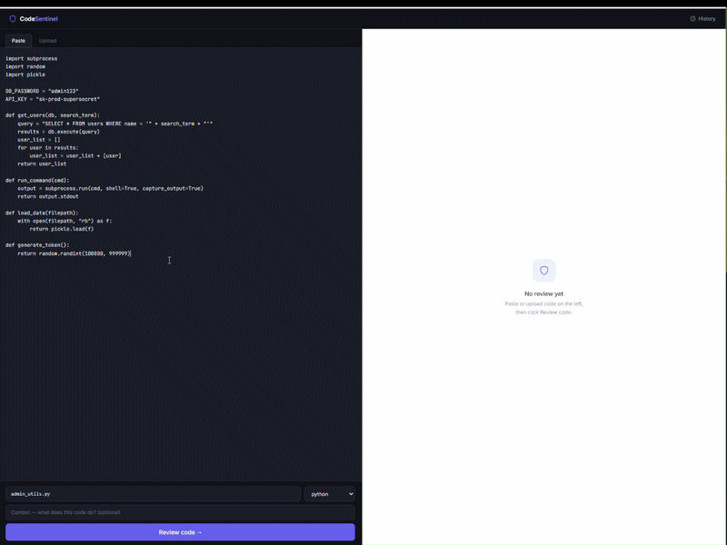
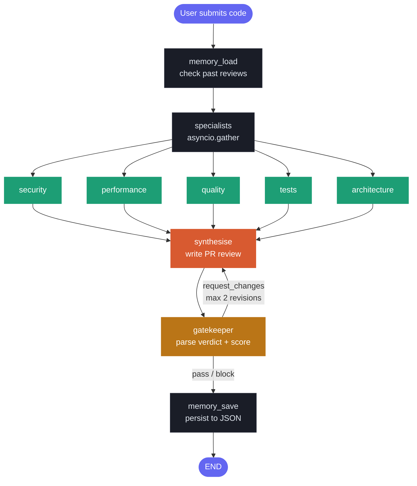

# CodeSentinel

<div align="center">


<br/>



<br/>

**A multi-agent code review system built with the Anthropic API and LangGraph.**  
Five specialist agents run in parallel, a synthesis agent writes a structured PR review,  
and a gatekeeper decides whether to pass, request changes, or block.

</div>

---

## Pipeline



---

## Orchestration concepts

| Concept | Where it appears |
|---|---|
| Supervisor / worker | Orchestrator delegates to 5 specialist agents |
| Parallel fan-out | `asyncio.gather` runs all 5 simultaneously |
| Shared state | `ReviewState` TypedDict flows through every node |
| Conditional branching | Gatekeeper routes to END or revision loop |
| Feedback loop | Multi-turn history passed back to synthesis on revision |
| Persistent memory | JSON store remembers past reviews across sessions |
| Error isolation | `return_exceptions=True` — one failure does not kill the rest |
| Observability | Every agent appends a trace entry with duration and tokens |

---

## Project structure

```
codesentinel/
│
├── backend/                         Python — FastAPI + multi-agent pipeline
│   │
│   ├── agents/
│   │   ├── security.py              Injection vulns, hardcoded secrets, dangerous calls
│   │   ├── performance.py           O(n²) loops, N+1 queries, missing caching
│   │   ├── quality.py               Type hints, naming, error handling, dead code
│   │   ├── tests.py                 Test coverage gaps, missing edge cases
│   │   ├── architecture.py          SRP violations, tight coupling, poor separation
│   │   ├── synthesis.py             Combines all 5 reviews into structured PR review
│   │   └── gatekeeper.py            Parses verdict, applies overrides, routes graph
│   │
│   ├── graph/
│   │   ├── state.py                 ReviewState TypedDict — shared data contract
│   │   └── pipeline.py              LangGraph StateGraph — nodes, edges, routing
│   │
│   ├── memory/
│   │   └── store.py                 JSON-based persistent memory store
│   │
│   ├── tools/
│   │   └── code_utils.py            Input cleaning, language detection, truncation
│   │
│   ├── tracing/
│   │   └── logger.py                make_trace() and print_traces() helpers
│   │
│   ├── api.py                       FastAPI server — /review, /history endpoints
│   ├── main.py                      CLI entry point
│   ├── requirements.txt
│   └── .env                         ANTHROPIC_API_KEY — never committed
│
└── frontend/                        React — Vite + Tailwind CSS
    ├── src/
    │   ├── App.jsx                  All React components
    │   ├── index.css                Styles and animations
    │   └── main.jsx                 Entry point
    ├── vite.config.js               Vite config + API proxy
    └── package.json
```

---

## Shared state

A single `ReviewState` TypedDict flows through every node. No agent mutates it in place — each returns a new copy with only its own field updated. This immutability pattern makes parallel execution safe and each agent independently testable.

```python
class ReviewState(TypedDict):
    # Input — set once, never changed
    code: str
    language: str
    context: str
    filename: str

    # Memory — filled by memory_load node
    past_review: Optional[dict]

    # Specialist results — each agent fills only its own field
    security_review: Optional[str]
    performance_review: Optional[str]
    quality_review: Optional[str]
    test_review: Optional[str]
    architecture_review: Optional[str]

    # Synthesis — filled after all specialists complete
    final_review: Optional[str]
    severity_score: Optional[int]      # 1–10
    review_history: list[dict]         # multi-turn history across revisions

    # Control flow — LangGraph reads decision to route
    decision: Optional[str]            # "pass" | "request_changes" | "block"
    gatekeeper_feedback: Optional[str]
    revision_count: int

    # Observability
    traces: list[dict]
```

---

## LangGraph graph

```python
graph = StateGraph(ReviewState)

graph.add_node("memory_load",  memory_load)
graph.add_node("specialists",  run_specialists)   # parallel fan-out
graph.add_node("synthesise",   synthesis_agent)
graph.add_node("gatekeeper",   gatekeeper_agent)
graph.add_node("memory_save",  memory_save)

graph.set_entry_point("memory_load")
graph.add_edge("memory_load", "specialists")
graph.add_edge("specialists", "synthesise")
graph.add_edge("synthesise",  "gatekeeper")

# conditional edge — reads state["decision"] to route
graph.add_conditional_edges(
    "gatekeeper",
    route_after_gatekeeper,
    {
        "end":        "memory_save",   # pass or block → save and finish
        "synthesise": "synthesise",    # request_changes → revision loop
    }
)

graph.add_edge("memory_save", END)
```

---

## Severity scoring

The synthesis agent scores each review from 1–10 using an explicit rubric:

| Score | Meaning |
|---|---|
| 1–2 | Style and nitpick issues only — safe to merge |
| 3–4 | Non-critical improvements recommended |
| 5–6 | High-severity issues, must fix before merge |
| 7–8 | Critical bug or data integrity risk |
| 9 | Critical security vulnerability or data loss risk |
| 10 | Immediate block — production system at serious risk |

The gatekeeper enforces hard overrides regardless of the LLM score:

- `SEVERITY: critical` in the security review → always block, minimum score 9
- Score ≥ 9 → always block
- Revision count ≥ 2 → force pass to stop infinite loops

---

## Persistent memory

Reviews are stored in `.codesentinel_memory.json` keyed by filename. On subsequent reviews of the same file, specialists receive previous findings and explicitly flag whether past issues are **FIXED**, **STILL PRESENT**, or **CANNOT DETERMINE**.

```json
{
  "admin_utils.py": {
    "decision": "block",
    "severity_score": 9,
    "summary": "Critical security vulnerabilities found.",
    "critical_issues": [
      "SQL injection in get_users() via string concatenation",
      "Hardcoded API key exposed in source code"
    ],
    "reviewed_at": "2026-06-24T10:23:45"
  }
}
```

---

## Setup

### Prerequisites

- Python 3.10+
- Node.js 18+
- Anthropic API key — get one at [console.anthropic.com](https://console.anthropic.com)

### Backend

```bash
cd backend

# create and activate virtual environment
python -m venv .venv
.venv\Scripts\activate        # Windows
source .venv/bin/activate     # Mac / Linux

# install dependencies
pip install -r requirements.txt

# create .env file
echo ANTHROPIC_API_KEY=sk-ant-... > .env

# run the API server
uvicorn backend.api:app --reload --port 8000
```

Auto-generated API docs available at `http://localhost:8000/docs`.

### Frontend

```bash
cd frontend
npm install
npm run dev
```

Open `http://localhost:5173`.

---

## API endpoints

| Method | Endpoint | Description |
|---|---|---|
| `POST` | `/review` | Review code submitted as text |
| `POST` | `/review/file` | Review an uploaded source file |
| `GET` | `/history` | List all reviewed files |
| `DELETE` | `/history/{filename}` | Clear memory for a file |
| `GET` | `/health` | Health check |

---

## Stack

| Layer | Technology |
|---|---|
| LLM | Anthropic Claude (claude-sonnet-4-6) |
| Orchestration | LangGraph StateGraph |
| Backend | FastAPI + uvicorn |
| Frontend | React + Vite + Tailwind CSS |
| Memory | JSON file store |
| Async | Python asyncio |

---

## Running the tests

```bash
cd backend
.venv\Scripts\activate

# milestone 1 — specialist agents (no API calls for isolation tests)
python test_milestone1.py free

# milestone 1 — parallel execution
python test_milestone1.py parallel

# milestone 2 — free tests (no API calls)
python test_milestone2.py free

# milestone 2 — full pipeline
python test_milestone2.py pipeline
```